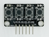
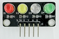
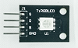
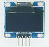
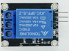
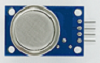
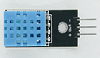
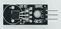
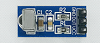
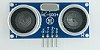

# 钛极OS标准驱动

钛极OS标准驱动包含一些基础传感器驱动，如按键， LED， OLED等等，这些驱动对应的传感器已经包含在TiKit开发套件中，用户可结合TiKit开发套件进行学习和实验。

## 驱动列表

| 传感器模块名称       | Java Class      | 型号           | 使用说明                                                     |                   图片                    |
| -------------------- | --------------- | -------------- | ------------------------------------------------------------ | :---------------------------------------: |
| 按键模块             | TiButton        | 通用           | [详情](http://dev.tijos.net/docstore/tijos-driver/tijos.framework.sensor.button/) |            |
| LED灯模块            | TiLED           | 通用           |  [详情](http://dev.tijos.net/docstore/tijos-driver/tijos.framework.transducer.led/)                                                            |                  |
| 三基色灯模块         | TiRGBLED        | 通用           |  [详情](http://dev.tijos.net/docstore/tijos-driver/tijos.framework.transducer.led/)                                                            |            |
| OLED12864显示模块    | TiOLED_UG2864   | UG2864         |   [详情](http://dev.tijos.net/docstore/tijos-driver/tijos.framework.transducer.led/)                                                            |  |
| 单通道继电器模块     | TiRelay1CH      | 通用           |  [详情](http://dev.tijos.net/docstore/tijos-driver/tijos.framework.transducer.relay/)                                                            |        |
| 可燃气体浓度检测模块 | TiMQ            | MQ系列传感器   | [详情](http://dev.tijos.net/docstore/tijos-driver/tijos.framework.sensor.mq/)                                                             |                  |
| 数字温湿度采集模块   | TiDHT           | DHT11          |  [详情](http://dev.tijos.net/docstore/tijos-driver/tijos.framework.sensor.dht/)                                                            |              |
| 数字温度采集模块     | TiDS18B20       | DS18B20        |  [详情](http://dev.tijos.net/docstore/tijos-driver/tijos.framework.sensor.ds18b20/)                                                            |          |
| 有源蜂鸣器模块       | TiBuzzer        | 通用           |  [详情](http://dev.tijos.net/docstore/tijos-driver/tijos.framework.transducer.buzzer/)                                                            |            |
| 红外接收模块         | TiVS1838BNEC    | VS1838B        | [详情](http://dev.tijos.net/docstore/tijos-driver/tijos.framework.sensor.vs1838b/)                                                             |        |
| 超声波测距模块       | TiHSCR04        | HCSR04/HCSR04+ |  [详情](http://dev.tijos.net/docstore/tijos-driver/tijos.framework.sensor.hcsr/)                                                            |            |
| 通用传感器           | TiGeneralSensor | 通用           |   [详情](http://dev.tijos.net/docstore/tijos-driver/tijos.framework.sensor.general/)                                                           |               通用4线传感器               |

## 更多驱动

钛极驱动中心汇总了目前钛极OS支持的传感器、通讯模块及应用组件，请访问钛极驱动中以获得更多信息.

